- Table of Contents
{:toc}

---

## **Acknowledgements**

- This project is based on the AddressBook-Level3 project created by the [SE-EDU initiative](https://se-education.org).
- Libraries used: [JavaFX](https://openjfx.io/), [Jackson](https://github.com/FasterXML/jackson), [JUnit5](https://github.com/junit-team/junit5)
---

## **Setting up, getting started**

Refer to the guide [_Setting up and getting started_](SettingUp.md).

---

## **Design**

:bulb: **Tip:** The `.puml` files used to create diagrams in this document can be found in the [diagrams](https://github.com/se-edu/addressbook-level3/tree/master/docs/diagrams/) folder. Refer to the [_PlantUML Tutorial_ at se-edu/guides](https://se-education.org/guides/tutorials/plantUml.html) to learn how to create and edit diagrams.

### Architecture

The **_Architecture Diagram_** given above explains the high-level design of the App.

Given below is a quick overview of main components and how they interact with each other.

**Main components of the architecture**

**`Main`** has two classes called [`Main`](https://github.com/se-edu/addressbook-level3/tree/master/src/main/java/seedu/address/Main.java) and [`MainApp`](https://github.com/se-edu/addressbook-level3/tree/master/src/main/java/seedu/address/MainApp.java). It is responsible for,

- At app launch: Initializes the components in the correct sequence, and connects them up with each other.
- At shut down: Shuts down the components and invokes cleanup methods where necessary.

[**`Commons`**](#common-classes) represents a collection of classes used by multiple other components.

The rest of the App consists of four components.

- [**`UI`**](#ui-component): The UI of the App.
- [**`Logic`**](#logic-component): The command executor.
- [**`Model`**](#model-component): Holds the data of the App in memory.
- [**`Storage`**](#storage-component): Reads data from, and writes data to, the hard disk.

**How the architecture components interact with each other**

The _Sequence Diagram_ below shows how the components interact with each other for the scenario where the user issues the command `delete 1`.

Each of the four main components (also shown in the diagram above),

- defines its _API_ in an `interface` with the same name as the Component.
- implements its functionality using a concrete `{Component Name}Manager` class (which follows the corresponding API `interface` mentioned in the previous point.

For example, the `Logic` component defines its API in the `Logic.java` interface and implements its functionality using the `LogicManager.java` class which follows the `Logic` interface. Other components interact with a given component through its interface rather than the concrete class (reason: to prevent outside component's being coupled to the implementation of a component), as illustrated in the (partial) class diagram below.

The sections below give more details of each component.

### UI component

The **API** of this component is specified in [`Ui.java`](https://github.com/se-edu/addressbook-level3/tree/master/src/main/java/seedu/address/ui/Ui.java)

The UI consists of a `MainWindow` that is made up of parts e.g.`CommandBox`, `ResultDisplay`, `PersonListPanel`, `StatusBarFooter` etc. All these, including the `MainWindow`, inherit from the abstract `UiPart` class which captures the commonalities between classes that represent parts of the visible GUI.

The `UI` component uses the JavaFx UI framework. The layout of these UI parts are defined in matching `.fxml` files that are in the `src/main/resources/view` folder. For example, the layout of the [`MainWindow`](https://github.com/se-edu/addressbook-level3/tree/master/src/main/java/seedu/address/ui/MainWindow.java) is specified in [`MainWindow.fxml`](https://github.com/se-edu/addressbook-level3/tree/master/src/main/resources/view/MainWindow.fxml)

The `UI` component,

- executes user commands using the `Logic` component.
- listens for changes to `Model` data so that the UI can be updated with the modified data.
- keeps a reference to the `Logic` component, because the `UI` relies on the `Logic` to execute commands.
- depends on some classes in the `Model` component, as it displays `Person` object residing in the `Model`.

### Logic component

**API** : [`Logic.java`](https://github.com/se-edu/addressbook-level3/tree/master/src/main/java/seedu/address/logic/Logic.java)

Here's a (partial) class diagram of the `Logic` component:

How the `Logic` component works:

1. When `Logic` is called upon to execute a command, it uses the `SurvinParser` class to parse the user command.
2. This results in a `Command` object (more precisely, an object of one of its subclasses e.g., `AddCommand`) which is executed by the `LogicManager`.
3. The command can communicate with the `Model` when it is executed (e.g. to add a person).
4. The result of the command execution is encapsulated as a `CommandResult` object which is returned back from `Logic`.

The Sequence Diagram below illustrates the interactions within the `Logic` component for the `execute("delete 1")` API call.

:information_source: **Note:** The lifeline for `DeleteCommandParser` should end at the destroy marker (X) but due to a limitation of PlantUML, the lifeline reaches the end of diagram.

Here are the other classes in `Logic` (omitted from the class diagram above) that are used for parsing a user command:

How the parsing works:

- When called upon to parse a user command, the `SurvinParser` class creates an `XYZCommandParser` (`XYZ` is a placeholder for the specific command name e.g., `AddCommandParser`) which uses the other classes shown above to parse the user command and create a `XYZCommand` object (e.g., `AddCommand`) which the `SurvinParser` returns back as a `Command` object.
- All `XYZCommandParser` classes (e.g., `AddCommandParser`, `DeleteCommandParser`, ...) inherit from the `Parser` interface so that they can be treated similarly where possible e.g, during testing.

### Model component

**API** : [`Model.java`](https://github.com/se-edu/addressbook-level3/tree/master/src/main/java/seedu/address/model/Model.java)

The `Model` component,

- stores Survin data i.e., all `Person` objects (which are contained in a `UniquePersonList` object).
- stores the currently 'selected' `Person` objects (e.g., results of a search query) as a separate _filtered_ list which is exposed to outsiders as an unmodifiable `ObservableList<Person>` that can be 'observed' e.g. the UI can be bound to this list so that the UI automatically updates when the data in the list change.
- stores a `UserPref` object that represents the user’s preferences. This is exposed to the outside as a `ReadOnlyUserPref` objects.
- does not depend on any of the other three components (as the `Model` represents data entities of the domain, they should make sense on their own without depending on other components)

:information_source: **Note:** An alternative (arguably, a more OOP) model is given below. It has a `Tag` list in the `Survin`, which `Person` references. This allows `Survin` to only require one `Tag` object per unique tag, instead of each `Person` needing their own `Tag` objects. 

### Storage component

**API** : [`Storage.java`](https://github.com/se-edu/addressbook-level3/tree/master/src/main/java/seedu/address/storage/Storage.java)

The `Storage` component,

- can save both Survin data and user preference data in json format, and read them back into corresponding objects.
- inherits from both `SurvinStorage` and `UserPrefStorage`, which means it can be treated as either one (if only the functionality of only one is needed).
- depends on some classes in the `Model` component (because the `Storage` component's job is to save/retrieve objects that belong to the `Model`)

### Common classes

Classes used by multiple components are in the `seedu.address.commons` package.

---

## **Implementation**

This section describes some noteworthy details on how certain features are implemented.

### \[Proposed\] Undo/redo feature

#### Proposed Implementation

The proposed undo/redo mechanism is facilitated by `VersionedSurvin`. It extends `Survin` with an undo/redo history, stored internally as an `survinStateList` and `currentStatePointer`. Additionally, it implements the following operations:

- `VersionedSurvin#commit()` — Saves the current Survin state in its history.
- `VersionedSurvin#undo()` — Restores the previous Survin state from its history.
- `VersionedSurvin#redo()` — Restores a previously undone Survin state from its history.

These operations are exposed in the `Model` interface as `Model#commitSurvin()`, `Model#undoSurvin()` and `Model#redoSurvin()` respectively.

Given below is an example usage scenario and how the undo/redo mechanism behaves at each step.

Step 1. The user launches the application for the first time. The `VersionedSurvin` will be initialized with the initial Survin state, and the `currentStatePointer` pointing to that single Survin state.

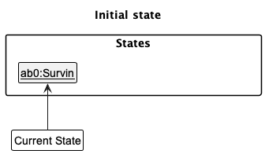

Step 2. The user executes `delete 5` command to delete the 5th person in Survin. The `delete` command calls `Model#commitSurvin()`, causing the modified state of Survin after the `delete 5` command executes to be saved in the `survinStateList`, and the `currentStatePointer` is shifted to the newly inserted Survin state.

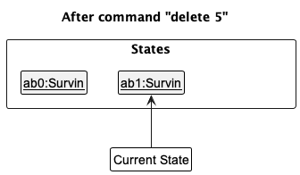

Step 3. The user executes `add n/David …​` to add a new person. The `add` command also calls `Model#commitSurvin()`, causing another modified Survin state to be saved into the `survinStateList`.

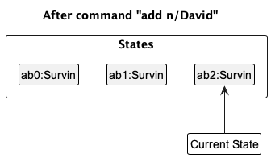

:information_source: **Note:** If a command fails its execution, it will not call `Model#commitSurvin()`, so the Survin state will not be saved into the `survinStateList`.

Step 4. The user now decides that adding the person was a mistake, and decides to undo that action by executing the `undo` command. The `undo` command will call `Model#undoSurvin()`, which will shift the `currentStatePointer` once to the left, pointing it to the previous Survin state, and restores Survin to that state.

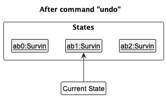

:information_source: **Note:** If the `currentStatePointer` is at index 0, pointing to the initial Survin state, then there are no previous Survin states to restore. The `undo` command uses `Model#canUndoSurvin()` to check if this is the case. If so, it will return an error to the user rather
than attempting to perform the undo.

The following sequence diagram shows how the undo operation works:

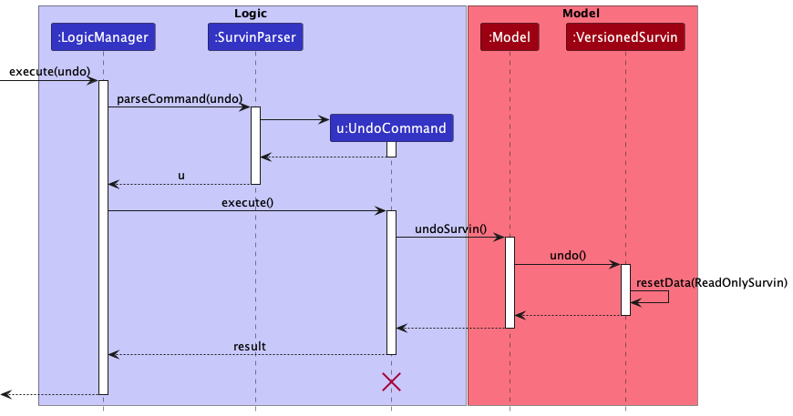

:information_source: **Note:** The lifeline for `UndoCommand` should end at the destroy marker (X) but due to a limitation of PlantUML, the lifeline reaches the end of diagram.

The `redo` command does the opposite — it calls `Model#redoSurvin()`, which shifts the `currentStatePointer` once to the right, pointing to the previously undone state, and restores Survin to that state.

:information_source: **Note:** If the `currentStatePointer` is at index `survinStateList.size() - 1`, pointing to the latest Survin state, then there are no undone Survin states to restore. The `redo` command uses `Model#canRedoSurvin()` to check if this is the case. If so, it will return an error to the user rather than attempting to perform the redo.

Step 5. The user then decides to execute the command `list`. Commands that do not modify the Survin, such as `list`, will usually not call `Model#commitSurvin()`, `Model#undoSurvin()` or `Model#redoSurvin()`. Thus, the `survinStateList` remains unchanged.

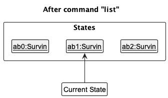

Step 6. The user executes `clear`, which calls `Model#commitSurvin()`. Since the `currentStatePointer` is not pointing at the end of the `survinStateList`, all Survin states after the `currentStatePointer` will be purged. Reason: It no longer makes sense to redo the `add n/David …​` command. This is the behavior that most modern desktop applications follow.

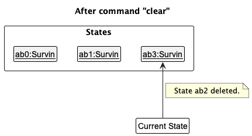

The following activity diagram summarizes what happens when a user executes a new command:

#### Design considerations:

**Aspect: How undo & redo executes:**

- **Alternative 1 (current choice):** Saves the entire Survin state.
  
  - Pros: Easy to implement.
  - Cons: May have performance issues in terms of memory usage.

- **Alternative 2:** Individual command knows how to undo/redo by
  itself.
  
  - Pros: Will use less memory (e.g. for `delete`, just save the person being deleted).
  - Cons: We must ensure that the implementation of each individual command are correct.

_{more aspects and alternatives to be added}_

### \[Proposed\] Data archiving

_{Explain here how the data archiving feature will be implemented}_

### Changing themes

#### Implementation

Implementing this feature will require the `MainWindow` to keep track of the current theme of Survin. This is done with an enum called `Theme` which is kept in a container class called `Themes`. `Themes` also stores static String variables to represent what users should type to swap to that theme.

Currently, since there are only 2 themes, there is a toggle button in GUI to toggle between the 2 themes. The method that is called when the button is pressed is called `handleLightDarkTheme()` in `MainWindow`. When called it simply checks what the current theme is and sets the theme to the other one. To keep things simple, the `theme` command also uses this `handleLightDarkTheme()` command to change the themes. A user invoking the `theme` command will result in the call of the `handeThemeCommand(Theme)` method in `MainWindow` which will only call `handleLightDarkTheme()` if the specified theme to change to is different from the current theme. This gives the expected behavior of the `theme` command using the toggling nature of `handeLightDarkTheme()`.

Below is the sequence diagram that explains how the `theme` command works:
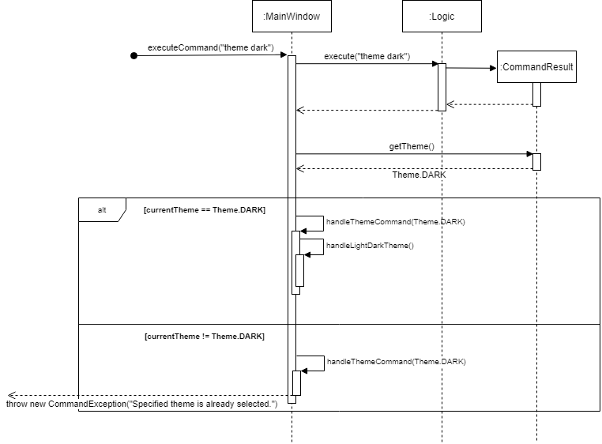
(Note: Details of the creation of CommandResult is similar to the Delete Command just without the update to model. You can find the sequence diagram for that command under the Logic Component section.)

#### Adding more themes (In the future)

The `theme` command was implemented with the addition of more themes in mind. First, add the names of the new themes in the container class `Themes` and their stylesheets in `resources/view`. Then just edit the `handleThemeCommand(Theme)` method with a simple switch case to change the stylesheet based on the specified theme. And since there is more than 2 themes, a toggle button would no longer work so you might want to replace that with a ComboBox or something similar. This also means that then `handleLightDarkTheme()` command is obsolete and can be removed.

### Compactable and expandable PersonCard

This feature is accomplished by recording the current state of the `PersonCard` with a boolean variable called `isExpanded`. `isExpanded` is true if `PersonCard` is expanded and false if `PersonCard` is compacted. `isExpanded` is set to `false` by default so that the application starts with all `PersonCard` compacted.

There is also a listener that listens to mouse clicks on each `PersonCard`. Clicking on a `PersonCard` calls one of two methods depending on its `isExpanded` value. If `isExpanded` is `true`, it calls `hideLabels()`. If `isExpanded` is `false`, it calls `showLabels()`.

`showLabels()` calls `setManaged(true)` and `setVisible(true)` on all elements that should be shown and managed for when expanding a `PersonCard`. `hideLabels()` likewise calls `setManage(false)` and `setVisible(false)` on all elements that should be hidden and not managed for when compacting a `PersonCard`.

:information_source: **Note:** It is required to `setManaged(true)` or `setManaged(false)` when showing or hiding respectively, if not `PersonCard` will not account for space for the shown elements or will account for space for hidden elements.

The sequence diagram below shows how the process works:

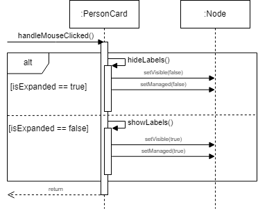

Due to the way the `updateItem` method works in the `ListCell` class. There were some undesirable effects in the UI. Whenever the user clicks on a `PersonCard`, two things would happen, `handleMouseClicked` and `updateItem` would be called. `updateItem` would create a new `PersonCard` to replace the old `PersonCard`. This is good if there was an update to the `PersonCard` but in this case there was no update. This results in the `handleMouseClicked` call to be useless since it was called in the `PersonCard` that was replaced. The newly created `PersonCard` would default to its original state of being compacted and effectively nothing would happen from the click the user made.

The sequence diagram below demonstrates the problem:

To stop this from happening, `updateItem` has to create a new `PersonCard` only if the `PersonCard` to be created is not the same as the current `PersonCard`. Now even if `updateItem` is called, no new `PersonCard` is created unless it is a different `PersonCard`. This results in the expected behavior of resetting the state of a `PersonCard` to its default state if it changes and keeping its state, since it is not replaced, if it is the same `PersonCard`.

The activity diagram below explains what happens when the user clicks on a `PersonCard`:

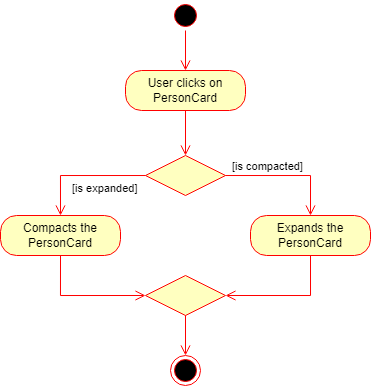

### Improved `DeleteCommand`

To accomodate the new functionality of `delete`, we make modifications in both `DeleteCommandParser` and `DeleteCommand` classes.

In the `DeleteCommandParser` class, we made use of a regex string to check if the user specified a digit or attributes. If the user provided a number, then the `parse` method would parse the input as an index. Else, the method would attempt to parse for the attributes. If none is provided, then we will throw an exception.

Since the user can provide any number of the three attributes (from 1 to 3 inclusive), it is natural to make use of the `Optional` container object, which is rather helpful in avoiding the usage of `null` in the implementation.

For the `DeleteCommand` class, the idea is rather straightforward where we make use of `Predicate` so that we can make use of the `updateFilteredPersonList` method in the `ModelManager` class. Note that if the user specified a survey, we would only remove the person if that was the only survey that the person is involved in, or else, we would just remove the survey from the person.

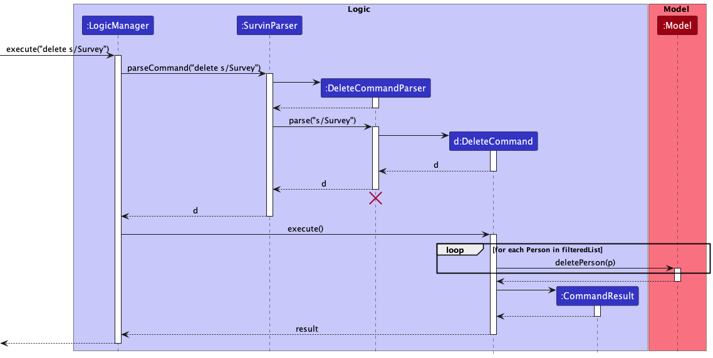

### `ViewCommand` feature

This feature allows users to view `Person` objects with specified attributes. The current implementation supports viewing keywords in any of the following fields
1. `Name`
2. `Phone`
3. `Email`
4. `Address`
5. `Gender`
6. `Birthdate`
7. `Race`
8. `Religion`
9. `Survey`
10. `Tag`

This is a new enhancement in v1.3, as older iterations did not support viewing by `Survey` or `Tag`. We hope that this implementation allows the user to filter and view specific demographics more easily, for example, viewing all chinese males that has participated in a Food survey.

This is achieved in the `ViewCommand` and `ViewCommandParser` classes.

In `ViewCommandParser`, we make use of the `ArugmenetMultimap` class to parse the user input and interprets them to get the values of the suffixes input by the user. Note that there is a possibility that the values to said suffixes are `null`, but this is handled by wrapping them in an `Optional` by `ArgumentMultimap`.

With this list of values, we make use of `Predicate` to define a predicate which returns true whenever a person contains the attributes as specified by the list of values, and returns false otherwise.

The predicate is then passed into `ViewCommand`, where we call `updateFilteredPersonList` in the `ModelManager` class to get a filtered list of people satisfying the predicate.

The sequence diagram below shows how the process works:

### `CloneCommand` feature

This feature allows the user to clone all details of an existing surveyee with updated attribute. It is accomplished mainly using the `CloneCommandParser` and `CloneCommand` classes.

In the `CloneCommandParser` class, we parse the arguments using `ArgumentMultimap` class and check which attributes are present in the arguments. We will then create a `ClonePersonDescriptor` object to store these attributes.

In the `CloneCommand` class, we will retrieve the person we want to clone by `getFilteredPersonList` method, then call `createClonedPerson` method to compare the person we retrieved with the `ClonePersonDescriptor` object, get the updated attributes and return a new person. Then call `addPerson` method in `ModelManager` to add this newly created person in.

Note that if the new person we cloned is already in Survin, it will trigger a duplicate cloned person exception.

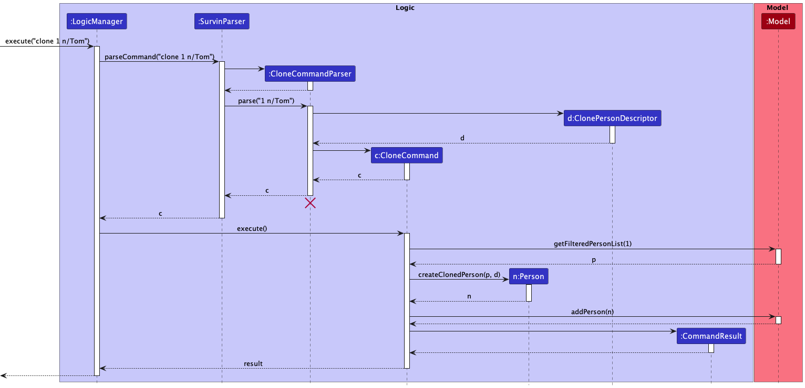

## **Documentation, logging, testing, configuration, dev-ops**

- [Documentation guide](Documentation.md)
- [Testing guide](Testing.md)
- [Logging guide](Logging.md)
- [Configuration guide](Configuration.md)
- [DevOps guide](DevOps.md)

---

## **Appendix: Requirements**

### Product scope

**Target user profile**:

- has a need to manage a significant number of surveyees
- prefer desktop apps over other types
- can type fast
- prefers typing to mouse interactions
- is reasonably comfortable using CLI apps

**Value proposition**: manage surveyees faster than a typical mouse/GUI driven app

### User stories

Priorities: High (must have) - `* * *`, Medium (nice to have) - `* *`, Low (unlikely to have) - `*`

| Priority             | As a …​ | I want to …​                                                                             | So that I can…​                                                        |
| -------------------- | ------- | ---------------------------------------------------------------------------------------- | ---------------------------------------------------------------------- |
| `* * *`              | user    | use 'add' in the command line                                                            | add a new surveyee quickly                                             |
| `* * *`              | user    | use 'edit' in the command line                                                           | edit a surveyee quickly                                                |
| `* * *`              | user    | use 'delete' in the command line                                                         | delete a surveyee quickly                                              |
| `* * *`              | user    | use 'view' in the command line                                                           | view my surveyees' information quickly                                 |
| `* *`                | user    | use 'clone' in the command line                                                          | use an existing surveyee as a template for a new surveyee to save time |
| `* *`                | user    | add on surveys or tags to existing surveyees without the need to retype everything again | save time and effort when adding on surveys and tags                   |
| `* *`                | user    | remove existing surveys or tags from surveyees without clearing everything               | save time and effort re-adding the ones I did not want to delete       |
| `* *`                | user    | hide more detailed information on a surveyee                                             | protect their information and have a less cluttered GUI                |
| `* *`                | user    | use 'view <attribute>' to view only surveyees of specific attribute                      | save time when looking for surveyees with a specific attribute         |
| `* *`                | user    | use 'delete <attribute>' to delete all surveyees with a specific attribute               | save time when deleting surveyees with a specific attribute            |
| `*`                  | user    | change between a 'light' and 'dark' theme                                                | have a GUI that is comfortable to use in the day and at night          |
| _{More to be added}_ |         |                                                                                          |                                                                        |

### Use cases

(For all use cases below, the **System** is the `Survin` and the **Actor** is the `user`, unless specified otherwise)

**Use case: Delete a surveyee**

**MSS**

1. User requests to list surveyees

2. Survin shows a list of surveyees

3. User requests to delete a specific surveyee in the list

4. Survin deletes the surveyee
   
   Use case ends.

**Extensions**

- 2a. The list is empty.
  
  Use case ends.

- 3a. The given index is invalid.
  
  - 3a1. Survin shows an error message.
    
    Use case resumes at step 2.

**Use case: view surveyees**

Preconditions: User can recall the part of a survey name

**MSS**

1. User would like to search for a specific demographic for a survey

2. User views such surveyees in the desired demographic with `view`

3. Survin displays all surveyees that matches the search and shows whether the survey has been completed

**Extensions**

- 2a. The survey name is not found.
  - 2a1. Survin returns an empty list.
  - 2a2. The user tries again with another survey keyword.
  
  Steps 2a1-2a2 are repeated until some keywords are matched

  Use case resumes from step 3.

**Use case: Append surveys/tags to a surveyee**

**MSS**

1. User requests to list surveyees

2. Survin shows a list of surveyees

3. User requests to append surveys and/or tags to a specific surveyee in the list

4. Survin appends requested surveys and/or tags to the surveyee
   
   Use case ends.

**Extensions**

- 2a. The list is empty.
  
  Use case ends.

- 4a. The requested surveys and/or tags already exist on the surveyee
  
  - 4a1. Survin shows an error message.
    
    Use case resumes at step 2.

**Use case: Unappend surveys/tags to a surveyee**

**MSS**

1. User requests to list surveyees

2. Survin shows a list of surveyees

3. User requests to unappend surveys and/or tags from a specific surveyee in the list

4. Survin unappends requested surveys and/or tags from the surveyee
   
   Use case ends.

**Extensions**

- 2a. The list is empty.
  
  Use case ends.

- 4a. The requested surveys and/or tags does not exist on the surveyee
  
  - 4a1. Survin shows an error message.
    
    Use case resumes at step 2.

**Use case: Change theme**

**MSS**

1. User requests to change the theme of Survin

2. Survin's theme changes
   
   Use case ends.

**Use case: Show/Hide more detailed information**

**MSS**

1. User requests to show/hide more detailed information of surveyees

2. Survin shows/hides more detailed information of surveyees
   
   Use case ends.

_{More to be added}_

### Non-Functional Requirements

1. Should work on any _mainstream OS_ as long as it has Java `11` or above installed.
2. A user with above average typing speed for regular English text (i.e. not code, not system admin commands) should be able to accomplish most of the tasks faster using commands than using the mouse.
3. No backend server required since local storage is used.

_{More to be added}_

### Glossary

- **Mainstream OS**: Windows, Linux, Unix, OS-X
- **Private contact detail**: A contact detail that is not meant to be shared with others

---

## **Appendix: Instructions for manual testing**

Given below are instructions to test the app manually.

:information_source: **Note:** These instructions only provide a starting point for testers to work on;
testers are expected to do more *exploratory* testing.

### Launch and shutdown

1. Initial launch
   
   1. Download the jar file and copy into an empty folder
   
   2. Double-click the jar file Expected: Shows the GUI with a set of sample contacts. The window size may not be optimum.

2. Saving window preferences
   
   1. Resize the window to an optimum size. Move the window to a different location. Close the window.
   
   2. Re-launch the app by double-clicking the jar file. 
      Expected: The most recent window size and location is retained.

3. _{ more test cases …​ }_

### Deleting a person

1. Deleting a person while all persons are being shown
   
   1. Prerequisites: List all persons using the `list` command. Multiple persons in the list.
   
   2. Test case: `delete 1` 
      Expected: First contact is deleted from the list. Details of the deleted contact shown in the status message. Timestamp in the status bar is updated.
   
   3. Test case: `delete 0` 
      Expected: No person is deleted. Error details shown in the status message. Status bar remains the same.
   
   4. Other incorrect delete commands to try: `delete`, `delete x`, `...` (where x is larger than the list size) 
      Expected: Similar to previous.

2. _{ more test cases …​ }_

### Appending surveys/tags to a surveyee

1. Appending surveys/tags to a surveyee while all surveyees are shown
   
   1. Prerequisites: List all persons using the `list` command. Multiple persons in the list.
   
   2. Test case: `append 1 s/New Survey` 
      Expected 1: First surveyee in the list has 'New Survey' added to their list of surveys 
      Expected 2: Error shown if first surveyee in the list already has 'New Survey' in their list of surveys before the command.
   
   3. Test case: `append 1 s/New Survey s/New Survey2 t/newTag t/newTag2` 
      Expected 1: First surveyee in the list has 'New Survey' and 'New Survey2' added to their list of surveys and has 'newTag' and 'newTag2' added to their list of tags. 
      Expected 2: Error shown if first surveyee in the list already has any of the surveys or tags specified in the command before the command.

### Unappending surveys/tags from a surveyee

1. Omitted as it is similar to 'Appending surveys/tags to a surveyee'

### Changing theme

1. Changing theme while in light theme
   
   1. Test case: `theme dark` 
      Expected: Survin changes to the dark theme.
   2. Test case: `theme light` 
      Expected: Survin shows an error message.
   3. Test case: Click on the `Appearance` tab and select `Dark Theme` 
      Expected: Survin changes to the dark theme.

2. Changing theme while in dark theme
   
   1. Test case: `theme light` 
      Expected: Survin changes to the light theme.
   2. Test case: `theme dark` 
      Expected: Survin changes to the dark theme.
   3. Test case: Click on the `Appearance` tab and select `Light Theme` 
      Expected: Survin changes to the light theme.

### Showing/Hiding more detailed information

1. Showing more detailed information
   
   1. Single surveyee
      
      1. Test case: Click on the surveyee you wish to show more details (Note: surveyee should be in the hiding more detailed information state)
         Expected: Surveyee will have their more detailed information shown.
   
   2. All surveyees
      
      1. Test case: `toggle-list-mode` 
         Expected: All surveyees have their more detailed information shown. (Note: The mode of the list will change, this means that new `PersonCard` will be created in this showing more detailed information state)
      
      2. Test case: Click on the `Appearance` tab and select `Expanded Cards` 
         Expected: All surveyees have their more detailed information shown. (Note: The mode of the list will change, this means that new `PersonCard` will be created in this showing more detailed information state)

2. Hiding more detailed information
   
   1. Omitted as it is similar to 'Showing more detailed information'.

### Saving data

1. Dealing with missing/corrupted data files
   
   1. _{explain how to simulate a missing/corrupted file, and the expected behavior}_

2. _{ more test cases …​ }_

## **Appendix: Effort**

### Challenges faced
1. Finding out that the `updateItem()` method was the reason for the buggy implementation of the compacted and expanded PersonCard took some time. There was a need to read a lot of documentation to find the fix.
2. Finding out how to change the stylesheet took some time. AB3 did not seem to use `Scene` due to the use of `FXMLLoader` and I needed to get the scene to get the stylesheet. Took a few hours to find out that the `Stage` class had a `getScene()` method.
